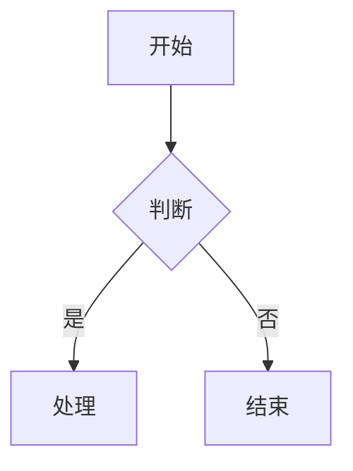

# 📖 小豆阅读器 使用说明书

> 版本：v1.0 ｜ 作者：流浪的小豆 ｜
---

## 一、软件简介

**小豆阅读器（mddou）** 是一款本地 Markdown 阅读与编辑工具，完全离线运行，轻量免费。支持标准 Markdown 语法渲染、Mermaid 流程图、LaTeX 数学公式、多标签页、导出 Word/PDF 等丰富功能，适合技术文档、笔记、读书摘录等场景。

---

## 二、安装与启动

### 2.1 安装方式

- **安装版**：运行 `mddou_installer.exe`，按向导选择安装路径，安装完成后自动创建桌面快捷方式，并注册 `.md` 文件关联（双击 .md 文件即可用阅读器打开）。

### 2.2 启动
- 双击桌面快捷方式「小豆阅读器」或直接运行 `mddou.exe`。
- 若已关联 `.md` 文件，直接双击任意 `.md` 文件即可启动并打开该文件。

---

## 三、界面布局

```
┌──────────────────────────────────────────────────────┐
│  菜单栏：文件 查看 编辑 帮助          赞助开发者       │
├──────────────────────────────────────────────────────┤
│  工具栏：新建 打开 保存 编辑/预览 分屏 查找 目录       │
│           A-  字号  A+   导出Word 导出PDF  语言切换    │
├──────────────────────────────────────────────────────┤
│  目录树  │          文档阅读/编辑区                    │
│  (可选)  │       (多标签页)                           │
├──────────────────────────────────────────────────────┤
│  状态栏：行/列位置  就绪/已保存  缩放比例              │
└──────────────────────────────────────────────────────┘
```

- **菜单栏**：文件、查看、编辑、帮助 + 右侧「赞助开发者」入口。
- **工具栏**：常用功能快捷按钮。
- **目录树**：左侧可折叠的标题导航（Ctrl+D 切换）。
- **阅读/编辑区**：多标签页，支持预览与编辑两种模式。
- **状态栏**：显示光标行列、文件状态、缩放比例。

---

## 四、基本操作

### 4.1 打开文件
| 方式 | 操作 |
|------|------|
| 工具栏 | 点击「打开」按钮（快捷键 Ctrl+O） |
| 拖拽 | 将 `.md` 文件直接拖入窗口 |
| 历史 | 文件菜单 → 从历史打开（Ctrl+L） |
| 关联 | 双击系统的 `.md` 文件（需已关联） |

### 4.2 新建与保存
- **新建标签**：Ctrl+T
- **保存文件**：Ctrl+S（编辑模式下保存后自动回到预览模式）
- **关闭标签**：Ctrl+W，或鼠标中键点击标签
- **切换标签**：Ctrl+Tab

### 4.3 编辑 / 预览切换
- 快捷键 **Ctrl+E**，或点击工具栏「编辑/预览」按钮。
- **预览模式**：渲染后的效果（阅读用）。
- **编辑模式**：等宽字体显示 Markdown 源码，可修改内容。

### 4.4 查找
- 快捷键 **Ctrl+F**，输入关键词即时高亮定位。
- 再次按 Ctrl+F 可关闭查找栏。

---

## 五、阅读功能

### 5.1 主题切换（查看菜单）
| 主题 | 说明 |
|------|------|
| 浅色页面 | 标准白底，日常阅读 |
| 纯白页面 | 极简白底 |
| 纯黑页面 | 深黑背景护眼 |
| 深蓝护眼 | 深蓝背景，适合长时间阅读 ⭐ |

### 5.2 字体缩放
- 工具栏 **A-** / **A+** 按钮，或快捷键 Ctrl+- / Ctrl++。
- **重置缩放**：Ctrl+0。

### 5.3 目录导航
- 快捷键 **Ctrl+D** 切换左侧目录树显示。
- 点击目录标题可快速跳转到对应章节，目录窗口支持拖动。

### 5.4 分屏模式
- 点击工具栏「分屏」按钮，同时显示源码与预览，左右对照编辑。
- 分屏下滚动同步联动。

### 5.5 Markdown 渲染支持
小豆阅读器完整支持以下 Markdown 语法：

- 标题（# ~ ######）
- 粗体、斜体、删除线、行内代码
- 有序/无序列表
- 引用块
- 表格
- 代码块（含语法高亮）
- 分隔线
- 链接与图片
- 自动识别目录结构

---

## 六、高级功能

### 6.1 Mermaid 流程图
在 Markdown 中使用代码块渲染流程图：

````markdown

````

渲染结果以图片形式插入，支持序列图、甘特图、类图等多种图表类型。

### 6.2 数学公式（LaTeX）
**行内公式**：`$E = mc^2$`

**块级公式**：使用 `$$` 包裹

```latex
$$
\int_0^\infty e^{-x^2} dx = \frac{\sqrt{\pi}}{2}
$$
```

支持常见数学符号、上下标、分数、根号、积分、求和等。

### 6.3 插入图片
- **粘贴**：在编辑模式直接 Ctrl+V 粘贴剪贴板截图。
- **拖入**：将图片文件拖入窗口。
- 图片自动保存到文档所在目录的 `images/` 子文件夹，并插入引用。

### 6.4 导出 Word 文档
- 工具栏「导出Word」→ 选择保存位置。
- 完整保留 Markdown 格式：标题层级、表格、代码块、引用、列表、图片、Mermaid 图表、数学公式均会渲染导出。

### 6.5 导出 PDF 文档
- 工具栏「导出PDF」→ 选择保存位置。
- 支持中文字体、代码高亮、公式与图表导出。

### 6.6 自动保存
- 编辑模式下自动保存到临时位置，防止意外丢失。

---

## 七、文件关联

安装版会自动注册 `.md` 文件关联。如果未生效，可手动操作：

1. 右键 `.md` 文件 → 打开方式 → 选择其他应用。
2. 找到 `mddou.exe` 并勾选「始终使用此应用打开 .md 文件」。

> 也可以在阅读器内「帮助 → 关联 .md 文件」尝试自动注册。

---

## 八、快捷键速查表

| 快捷键 | 功能 |
|--------|------|
| Ctrl+O | 打开文件 |
| Ctrl+T | 新建标签 |
| Ctrl+S | 保存 |
| Ctrl+W | 关闭当前标签 |
| Ctrl+Tab | 切换标签 |
| Ctrl+E | 编辑/预览切换 |
| Ctrl+F | 查找 |
| Ctrl+D | 目录树开关 |
| Ctrl+L | 从历史打开 |
| Ctrl+C | 复制 |
| Ctrl+A | 全选 |
| Ctrl++ / Ctrl+- | 放大 / 缩小 |
| Ctrl+0 | 重置缩放 |

---

## 九、常见问题（FAQ）

**Q1：双击 .md 文件没有用阅读器打开？**
A：检查文件关联是否注册成功。可右键 .md → 打开方式手动选择 mddou.exe，或重新运行安装版。

**Q2：Mermaid 图表显示异常或空白？**
A：确认代码块语言标记为 `mermaid`，且网络正常（首次渲染需调用本地命令行工具，后续走缓存）。

**Q3：数学公式渲染不出来？**
A：检查公式语法是否正确，行内公式用单 `$`，块级用双 `$$`，注意前后不能有空格。

**Q4：导出的 Word 里图片不显示？**
A：图片会自动保存到文档旁 `images/` 目录，导出时请保持原目录不被移动。

**Q5：编辑模式改了内容没保存就关标签？**
A：有自动保存保护，但建议养成 Ctrl+S 手动保存习惯。

---

## 十、版权与支持

- 本软件完全免费，本地运行，不上传任何数据。
- 如有帮助，欢迎在菜单栏右侧「赞助开发者」支持作者 ❤️。
- 遇到问题或建议，欢迎反馈给作者 流浪的小豆。

---

*感谢使用小豆阅读器 🦐*
